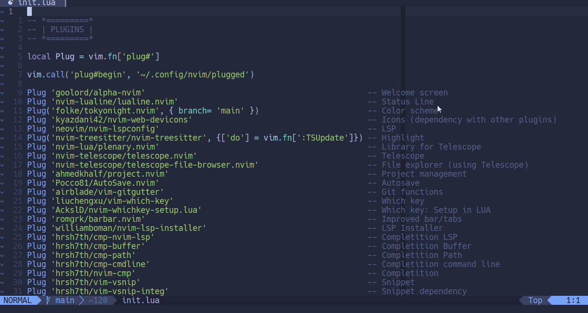
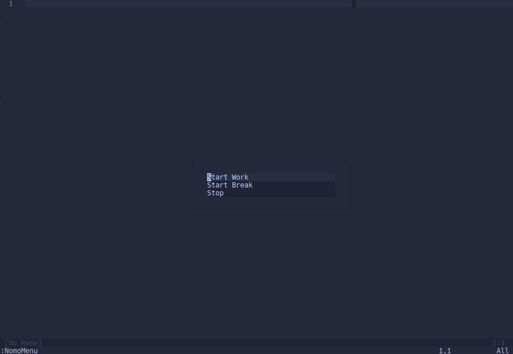

# 

Finally, Nvim + Pomodoro!

Yes, its another Pomodoro plugin for Nvim. Originally made to my own use and to learn the basics of plugin creation with Neovim. 

I decided to leave this available for everyone that can find it useful also and please feel free to use, copy, comment or change anything you want.



# Features

* Setup your pomodoro sessions time
* Start and Stop sessions
* Show status realtime from other plugins
* Not just Pomodoro focused! Custom timer for any use

# Quickstart

## Instalation

Using [vim-plug](https://github.com/junegunn/vim-plug)
```vim
Plug 'dbinagi/nomodoro'
```
## Setup

To load plugin with default configuration:
```lua
require('nomodoro').setup({})
```

# Setup

## Default Configuration

```lua
require('nomodoro').setup({
    work_time = 25,
    break_time = 5,
    menu_available = true,
    texts = {
        on_break_complete = "TIME IS UP!",
        on_work_complete = "TIME IS UP!",
        status_icon = "羽",
        timer_format = '!%0M:%0S' -- To include hours: '!%0H:%0M:%0S'
    }
})

```

# Commands

| Command | Description |
| ----------- | ----------- |
| NomoWork | Start work timer |
| NomoBreak | Start break timer |
| NomoStop | Stop all timers |
| NomoStatus | Print time left manually |
| NomoTimer N | Runs a timer for N minutes |

# Configure keys

By default, no shortcuts are provided, you could configure the following.

```lua
local map = vim.api.nvim_set_keymap
local opts = { noremap = true, silent = true }

map('n', '<leader>nw', '<cmd>NomoWork<cr>', opts)
map('n', '<leader>nb', '<cmd>NomoBreak<cr>', opts)
map('n', '<leader>ns', '<cmd>NomoStop<cr>', opts)
```

# Optional UI

## Integration with lualine

As an example, to integrate the status realtime with lualine use the following:

```lua

local lualine = require'lualine'
lualine.setup({
    sections = {
        lualine_x = {
            require('nomodoro').status,
        }
    }
})
```

## Integration with [nui.menu](https://github.com/MunifTanjim/nui.nvim)

If you like menus, you can install the dependency nui.menu and you will have enable a command `NomoMenu` to display options in a popup


